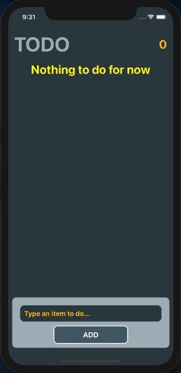

# Project-011 : TODO App (RN-03)

## Description

Project aims to create TODO Application with React Native.

## Problem Statement

- User can enter a todo item
- If user enters an empty string the app gives a warning
- Entered todo items should show up on the screen
- User can set the status of the items to done by pressing on each item
- User can delete an item by pressin on long
- The number of active todo items is always shown on the screen

